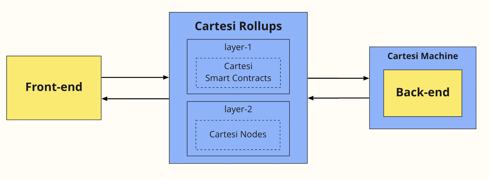

<Section name="1. Introduction" description="Introduction to Cartesi">

## Intro to Cartesi
  
Today, developers who aspire to create applications in the Web3 world are facing two main problems:

  1. Computational constraints of the blockchain and high fees.
  2. Lack of a mature software stack for decentralized applications.
  
[*Cartesi Rollups*](https://docs.cartesi.io/cartesi-rollups/overview/) solve these problems by providing a modular application-specific optimistic rollups with interactive dispute resolutions. Additionally, Cartesi offers a well-supported, mainstream virtual machine that can run real operating systems like Linux. This allows developers to build robust and scalable smart contracts using already existing toolchains.  
  
## Computational constraints of the blockchain
  
Ethereum’s rollups-centric roadmap divides the *Scalability* problem of the blockchain trilemma into two aspects: *data* scalability and *computation* scalability.

Rollups solutions are poised to break the *computational* constraints of blockchains. One particular solution that offers significant gains in computational scalability is application-specific rollups with interactive dispute resolutions, built on top of a general-purpose base layer. In this setup, the base layer is used for asset settlement, composability between applications, and dispute resolution, whereas the bulk of the computation is shifted to each application’s own rollup.  
  
## Lack of a mature software stack for Web3
  
In traditional Web2 software development, a full-fledged operating system provides developers with the tooling and libraries required to build and run applications. Despite the promising potential of Web3, the availability of essential tooling and libraries remains scarce and inadequate.

*Cartesi Rollups* solve this problem by providing a deterministic RISC-V-based VM - the [*Cartesi Machine*](https://docs.cartesi.io/cartesi-machine/) - which is capable of running Linux or other operating systems in a rollup. By doing this, Cartesi brings a computer like the ones we use everyday to the blockchain and allows developers to use rich preexisting code, libraries, tools, operating systems, compilers, interpreters, frameworks, databases and ecosystems for decentralized applications.   


## Question

<Quiz id={"????"}

What part of the blockchain trilemma does Cartesi address?

A. Scalability (Correct Answer)
B. Security
C. Decentralization

## Question

<Quiz id={"????"}

What challenges Cartesi aims to solve?
  
A. Computational constraints of the blockchain.
B. Lack of a mature runtime software stacks for Web3.
C. All of the above (Correct Answer)


/>

</Section>  
  
<Section name="2. Cartesi Rollups overview" description="Overview of Cartesi Rollups">

## What are Cartesi Rollups

*Cartesi Rollups* are application-specific optimistic rollups that can execute DApps with the full support of a Linux runtime along with existing Linux toolchains. In the *Cartesi Rollups* ecosystem: 

* Every DApp is deployed on its own customizable application-specific rollup chain with a dedicated CPU.
* DApps don't compete with each other in Cartesi’s ecosystem for scarce blockspace. Rather, each DApp has the entire blockspace just for itself.
* *Cartesi Rollups* provide significant gains in computational scalability.
* *Cartesi Rollups* offer a full-fledged operating system that offers industry-grade tooling for developers to create more expressive and computationally intensive blockchain applications.

The *Cartesi Rollups* ecosystem is based on a special RISC-V-based VM - the [Cartesi Machine](https://docs.cartesi.io/cartesi-machine/) - which is capable of running Linux or other operating systems within a rollups framework. This enables the development of scalable decentralized applications in traditional programming languages. The Cartesi Machine is capable of handling more intensive and intricate computations than the Ethereum Virtual Machine (EVM), which gives developers the power to build DApps that handle previously impossible use cases.

*Cartesi Rollups* can be used as a layer two (i.e. on top of Ethereum), layer three (i.e. on top of Arbitrum, Optimism, or ZK-EVM chains) or sovereign rollups (i.e. on top of Celestia).
  
## Cartesi Rollups security guarantee
  
*Cartesi Rollups* retain the strong security guarantees of the base layer by implementing fraud proofs with interactive dispute resolution.

The basis of our rollups is the *Cartesi Machine*, a fully deterministic and transparent RISC-V virtual machine. This allows for intricate and intensive computations to be performed in a verifiable way. One can build fraud proofs of any program executed in the *Cartesi Machine*, and optimistically prove the result of a RISC-V computation to any complex-enough base layer, such as Ethereum.

In summary, as long as there is one honest validator from a permissionless set of validators, Ethereum can give the correct settlement for any computation.   
  
## Question  
  
<Quiz id={"????"}

What types of Rollups does Cartesi use?

A. Optimistic Rollups (Correct Answer)
B. Zero-knowledge
C. None, Cartesi is a side-chain

## Question

<Quiz id={"????"}

Where do the complex computations of your DApp happen?
  
A. Inside a deterministic transparent VM called the Cartesi Machine (Correct Answer)
B. Cartesi cannot handle heavy computations
C. All computations happen On-chain

/>

</Section>


<Section name="3. Using Cartesi" description="How to use Cartesi Rollups">

## DApp Architecture





Each Cartesi DApp has two main parts:

1. [Front-end](https://docs.cartesi.io/cartesi-rollups/dapp-architecture/#front-end) — The user facing interface, which will often provide a UI (e.g., a web application) but may also be a command line interface (e.g., a hardhat task using ethers, or a command line using python).
  
2. [Back-end](https://docs.cartesi.io/cartesi-rollups/dapp-architecture/#back-end) — The verifiable logic that will run inside the Cartesi Rollups infrastructure; this will store and update the application state given user input, and will produce outputs in the form of [vouchers](https://docs.cartesi.io/cartesi-rollups/components/#vouchers) (transactions that can be carried out on layer-1) and [notices](https://docs.cartesi.io/cartesi-rollups/components/#notices) (information that can be validated on layer-1).

Aside from the back-end running inside the Cartesi Rollups infrastructure, the DApp front-end can of course also make use of external resources such as 3rd-party services. Indeed, for more complex DApps it is expected that there will be other back-ends besides the one running verifiable logic. These would be used whenever the application doesn’t really need a service to be decentralized and trustless, such as providing fast and accessible data caches, helping users communicate with each other, or interfacing with other non-blockchain services.

Conversely, it is also possible for complex DApps to provide more than one front-end application, with the goal of supporting different kinds of users and use cases.
  
## Start your first DApp locally
  
Let’s try locally running a simple existing DApp written in Python, called Echo-Python. The Echo-Python DApp simply copies (or "echoes") each input received as a corresponding output notice. 

Before you begin, make sure that you have [Docker](https://www.docker.com) installed on your local machine.

1. Clone the cartesi/rollups-examples Github repository by running the following command:
  
```
git clone https://github.com/cartesi/rollups-examples.git
```

2. Navigate to the DApp example directory by running the following command:
  
```
cd rollups-examples/echo-python
```

3. Build the Echo DApp by running the following command:
  
```
docker buildx bake --load
```

4. Start the application by running the following command:
  
```
docker compose -f ../docker-compose.yml -f ./docker-compose.override.yml up
```
  
## Interact with your DApp locally

Now that the application is up and running, let’s send out a request.

  1. Open a separate terminal window.
  2. From the rollups-examples base directory, navigate to the frontend-console one:

```
cd frontend-console
```

3. Build the frontend console application:
  
```
yarn
yarn build
```

4. Send an input to the current locally deployed DApp:
  
```
yarn start input send --payload "Hello, Cartesi."
```

5. Verify the outputs (notices) generated by your input, to display your DApp notices run the following command:
  
```
yarn start notice list
```

6. After completing all the steps above, you should get a response similar to the following:
  
```
[ { epoch: '0', input: '1', notice: '0', payload: 'Hello, Cartesi.' } ]
```

Congratulations, now you’ve successfully run the Cartesi DApp!

## Start your first DApp remotely
  
Now that we’ve successfully run and interacted with a local Cartesi DApp, let’s take it to the next level and interact with this Echo-Python application that we already have running on a public blockchain test network called Goerli.

1. Open a new terminal window.
2. Navigate to the `front-console` directory:
  
```
cd frontend-console
```
  
3. Build the frontend console application:
  
```
yarn
yarn build
```
  
4. Create an Ethereum account using Metamask as described in this [tutorial](https://myterablock.medium.com/how-to-create-or-import-a-metamask-wallet-a551fc2f5a6b). Make sure to save the Secret Backup Phrase (MNEMONIC user sequence of twelve words).
5. Get testnet funds/tokens on Goerli to be able to submit transactions on that network. There are several faucets available, you may try https://goerlifaucet.com/ or https://goerli-faucet.slock.it/
6. Create an [Alchemy](https://docs.alchemy.com/docs/alchemy-quickstart-guide) account to obtain an API key for reliable access to the Goerli network. Alternatively, you can use other options such as [Infura](https://www.infura.io/) or [Moralis](https://moralis.io/).
7. Configure your account on Goerli by running the commands below, which specify the network and MNEMONIC (Secret Backup Phrase) to use:
  
```
export NETWORK=goerli
export MNEMONIC="word1 word2 word3 word4 word5 word6 word7 word8 word9 word10 word11 word12"
```
  
8. Configure your Alchemy RPC gateway URL for Goerli by running the following command:
  
```
export RPC_URL=https://eth-goerli.alchemyapi.io/v2/<Replace_This_With_Your_Alchemy_API_key>
```
  
9. Send an input by running the command:
  
```
yarn start input send --payload "my new message" --dapp echo-python
```
  
10. Query the layer-2 Cartesi Node for notices produced by the DApp:
  
```
yarn start notice list --url https://echo-python.goerli.rollups.staging.cartesi.io/graphql
```

Well done! Now we have explored the way to interact with a Cartesi DApp running on a blockchain network.
  


## Question

<Quiz id={"????"}

What does a simple Cartesi DApp consist of?

A. Solidity smart contracts
B. Back-end and Front-end as any other traditional applications (Correct Answer)
C. Linux OS

/>

</Section>


<Section name="4. Resources" description="Developer Resources">

## Developer Resources

* [Documentation](https://docs.cartesi.io/) — The home for Cartesi documentation and learning for all kinds of developers, blockchain technology professionals, and researchers.
* [Run back-end in Host Mode](https://docs.cartesi.io/build-dapps/dapp-host-mode/) — When developing an application, it is often important to easily test and debug it. For that matter, it is possible to run the Cartesi Rollups environment in host mode.
* [DApp Examples](https://github.com/cartesi/rollups-examples) — Explore our DApps either on our [Github](https://github.com/cartesi/rollups-examples#examples) or on [Docs](https://docs.cartesi.io/build-dapps/run-dapp/#explore-our-dapps).
* [Rollups HTTP APIs](https://docs.cartesi.io/cartesi-rollups/http-api/) — In a Cartesi DApp, the front-end and back-end parts of the application communicate with each other through the Rollups framework. This is accomplished in practice by a set of HTTP APIs.
* [Rollups HTTP APIs reference](https://docs.cartesi.io/cartesi-rollups/api/) — APIs available for DApp developers to interact with the Cartesi Rollups framework.
* Watch [Groundbreaking Cartesi Rollups Project Use-cases](https://www.youtube.com/embed/videoseries?list=PL-srLb8IDxZU4_MFqEkri9t802kdYtI4o) or read developer stories on the [Cartesi Magazin](https://issuu.com/cartesi/docs/220830_cartesi_integrators_magazine_def) and know more about the stacks used, and how Web2 devs are onboarded to Web3 via Cartesi Rollups. We also [blog post](https://medium.com/@cartesi) regularly.
* [StackOverflow](https://stackoverflow.com/questions/tagged/cartesi) — Feel free to ask questions on StackOverflow or on [Discord](https://discord.gg/Pt2NrnS)), core Cartesi contributors and the wider developer ecosystem always eager to help.

</Section>
  
<Section name="4. Home to what’s next" description="Next steps">

## Home to what’s next
  
Join the Cartesi Hackathon track, and who knows, in a few months. You will be prototyping DApps that bring machine learning, biometrics, smart city solutions, or fully decentralized games to the blockchain, just as other developers did. On Cartesi Rollups, it's all possible, no matter if you're a first-time coder for blockchain.

Get ready to break new grounds. Explore in a decentralized manner. Take Linux to new places. We're home to what's next.


</Section>
